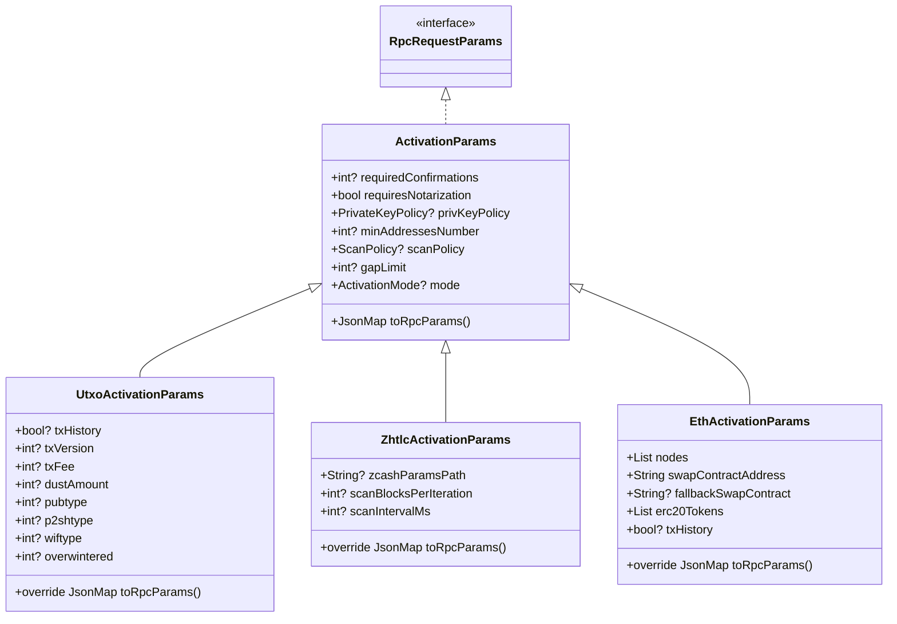
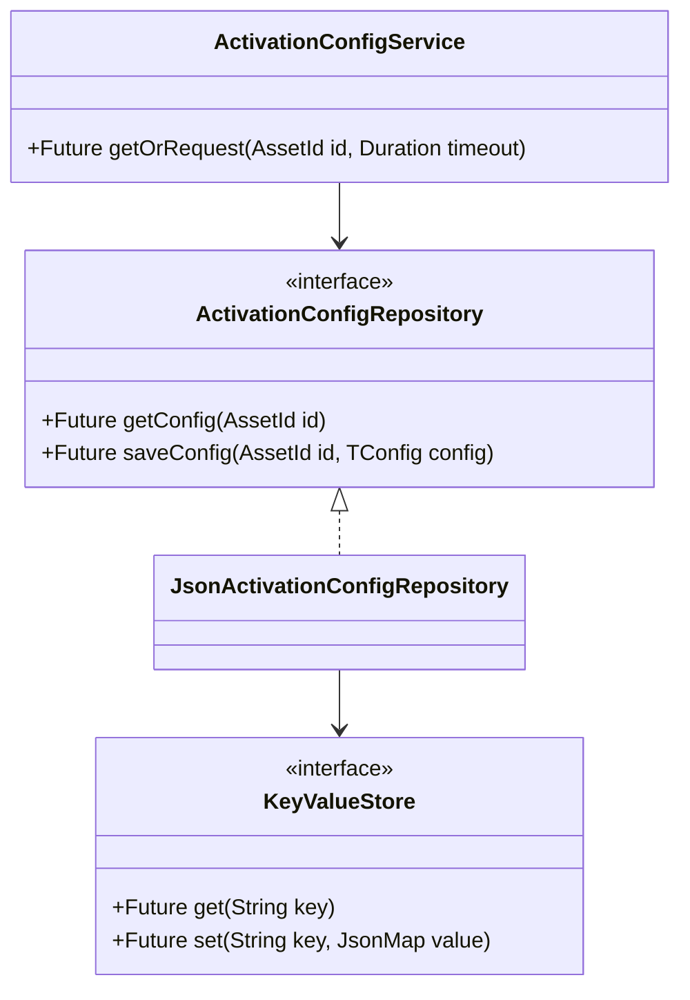

## Activation Parameters Architecture Refactoring Plan

### Purpose

Create a clean, extensible, and type‑safe activation parameters architecture for all supported protocols (UTXO, ZHTLC, ETH/ERC, Tendermint, etc.), with a unified approach to serialization, first‑class user configuration, persistence, and explicit state management for user interaction and timeouts.

### Scope

- No backward compatibility constraints. Design a clean architecture and migrate the SDK internals accordingly.
- Follow OOP principles and the relevant design patterns (Strategy, Repository, State, Factory, Builder).
- Follow BLoC naming conventions for any bloc code.
- Use `freezed` for type‑safe configuration schemas, and the existing JSON utilities from `json_type_utils.dart` for parsing/serialization helpers.
- Use `AssetId` in all public SDK APIs.

## 1) Architecture Design

### 1.1 Class Hierarchy (clean split of protocol concerns)

- Activation parameters WILL be protocol‑specific. The base class must only contain protocol‑agnostic fields.
  - Move ZHTLC‑specific fields out of the base class into `ZhtlcActivationParams`.
  - Keep ETH/ERC specific serialization in its subclass.
  - Keep UTXO extensions in its subclass.

Proposed structure:



Key rules:

- Base `ActivationParams` contains only protocol‑agnostic fields.
- Each subclass is solely responsible for its protocol‑specific fields and serialization.
- `toRpcParams()` follows a consistent pattern: base JSON merged with subclass JSON using `deepMerge` (from `json_type_utils.dart`).

### 1.2 Serialization Strategy (consistent approach)

- Introduce a small utility to normalize private key policy serialization across protocols while respecting API expectations.
- ETH/ERC requires JSON object form; other protocols use PascalCase enum string.

```dart
class PrivKeyPolicySerializer {
  static dynamic toRpc(PrivateKeyPolicy policy, {required CoinSubClass protocol}) {
    if (protocol == CoinSubClass.eth || protocol == CoinSubClass.erc20) {
      return policy.toJson(); // object form
    }
    return policy.pascalCaseName; // legacy PascalCase string
  }
}
```

Usage pattern in `toRpcParams()`:

- Base class sets all protocol‑agnostic fields EXCEPT `priv_key_policy`.
- Subclasses set `priv_key_policy` via `PrivKeyPolicySerializer.toRpc(policy, protocol: ...)` and merge their own fields.

This keeps the approach consistent while producing the protocol‑specific shape needed by the KDF API.

### 1.3 User Configuration Framework

Goals:

- Users can pre‑configure activation options per `AssetId`.
- If configuration exists, use automatically.
- Otherwise, enter an explicit “awaiting user action” state with a 60s timeout, then fallback (defaults) or fail gracefully.

Components:

- Configuration models (freezed) per protocol
- Repository abstraction for persistence
- Service for orchestration (read‑or‑request‑then‑persist)
- BLoC for state management and UI handoff (awaiting user input / timeout)



Example freezed config for ZHTLC:

```dart
@freezed
class ZhtlcUserConfig with _$ZhtlcUserConfig {
  const factory ZhtlcUserConfig({
    required String zcashParamsPath,
    @Default(1000) int scanBlocksPerIteration,
    @Default(0) int scanIntervalMs,
  }) = _ZhtlcUserConfig;

  factory ZhtlcUserConfig.fromJson(Map<String, dynamic> json) => _$$ZhtlcUserConfigFromJson(json);
}
```

Repository example (JSON‑backed):

```dart
class JsonActivationConfigRepository implements ActivationConfigRepository {
  JsonActivationConfigRepository(this.store);
  final KeyValueStore store;

  String _key(AssetId id) => 'activation_config:${id.id}';

  @override
  Future<TConfig?> getConfig<TConfig>(AssetId id) async {
    final data = await store.get(_key(id));
    if (data == null) return null;
    // Use a registry/mapper for different configs
    return ActivationConfigMapper.decode<TConfig>(data);
  }

  @override
  Future<void> saveConfig<TConfig>(AssetId id, TConfig config) async {
    final json = ActivationConfigMapper.encode(config);
    await store.set(_key(id), json);
  }
}
```

### 1.4 Persistence Layer Design

- `KeyValueStore` abstraction for portability (Flutter, CLI, web):
  - Default: in‑memory (SDK core dependency‑free)
  - Optional adapters: `shared_preferences` (Flutter), `localstorage` (web), file‑based JSON (CLI)
- `ActivationConfigRepository` uses `KeyValueStore` and a `ActivationConfigMapper` to encode/decode typed configs.
- Stored shape is `JsonMap` compatible with `jsonEncode`/`jsonDecode`.

### 1.5 State Management System

- Introduce a dedicated BLoC to manage the read‑or‑request flow with timeout.
- Naming follows BLoC conventions: Events end with `Event`, States end with `State`, Bloc ends with `Bloc`.

States:

- `ActivationConfigInitialState`
- `ActivationConfigCheckingState`
- `ActivationConfigAwaitingInputState` (includes `deadlineAt`, optional suggested defaults)
- `ActivationConfigReadyState<TConfig>` (contains the resolved config)
- `ActivationConfigTimeoutState`
- `ActivationConfigFailureState`

Events:

- `ActivationConfigRequestedEvent(AssetId assetId)`
- `ActivationConfigSubmittedEvent<TConfig>(TConfig config)`
- `ActivationConfigCancelledEvent()`
- `ActivationConfigTimeoutEvent()`

Timeout policy:

- Default 60 seconds. On timeout: if required fields missing, fail; otherwise use defaults.

ActivationProgress integration (type‑safe):

- Avoid using `additionalInfo` for control‑flow signals. Use typed fields or dedicated events/states.
- When entering the awaiting state, emit a standard `ActivationProgress` message with `currentStep: ActivationStep.planning` for display, while the control signal is represented by the BLoC state `ActivationConfigAwaitingInputState`.

### 1.6 Integration Points (SDK)

- `KomodoDefiSdk` gains an `ActivationConfigService` dependency (optionally provided) used by activation strategies.
- `ZhtlcActivationStrategy` reads persisted config or requests it before calling RPC `enable_zhtlc::init`.
- `UtxoActivationStrategy`, `Eth*` strategies can opt‑in to the same pattern as needed.

### 1.7 KDF API alignment: endpoints and JSON shapes

The design must match the KDF API contract for activation tasks across protocols.

- Common task flow per protocol:

  - `task::enable_<protocol>::init` — starts activation with `{ ticker, activation_params }`
  - `task::enable_<protocol>::status` — polls activation status with `{ task_id, forget_if_finished }`
  - `task::enable_<protocol>::user_action` — optional, awaited user input (protocol‑specific)
  - `task::enable_<protocol>::cancel` — optional, cancels activation task

- Base request envelope includes `mmrpc: "2.0"`, `method`, and `params`.

- Activation mode and rpc_data serialization:

  - `mode.rpc` is one of `Electrum`, `Native`, `Light`.
  - `mode.rpc_data` differs by mode:
    - Electrum: `servers: [ActivationServer...]`
    - Light (ZHTLC):
      - `light_wallet_d_servers: [String]` (ZHTLC only)
      - `electrum_servers: [ActivationServer...]` (note: key name differs from Electrum)
      - `sync_params`: one of:
        - `"earliest"`
        - `{ "height": <int> }`
        - `{ "date": <unix_timestamp> }`
        - The SDK parser also supports legacy `<int>` and heuristics, but requests should use the documented shapes above.

- Activation server shape (as produced by `ActivationServers.toJsonRequest()`):

  - `{ "url": <string>, "ws_url": <string?>, "protocol": <string>, "disable_cert_verification": <bool> }`

- ZHTLC init example (shape):

```json
{
  "mmrpc": "2.0",
  "method": "task::enable_z_coin::init",
  "params": {
    "ticker": "ZEC",
    "activation_params": {
      "required_confirmations": 1,
      "requires_notarization": false,
      "priv_key_policy": "ContextPrivKey",
      "min_addresses_number": 20,
      "scan_policy": "do_not_scan",
      "gap_limit": 20,
      "mode": {
        "rpc": "Light",
        "rpc_data": {
          "light_wallet_d_servers": ["https://lightd.example"],
          "electrum_servers": [
            {
              "url": "ssl://electrum.example:50002",
              "protocol": "TCP",
              "disable_cert_verification": false
            }
          ],
          "sync_params": "earliest"
        }
      },
      "zcash_params_path": "/path/to/zcash-params",
      "scan_blocks_per_iteration": 1000,
      "scan_interval_ms": 0
    }
  }
}
```

- UTXO init example (shape):

```json
{
  "mmrpc": "2.0",
  "method": "task::enable_utxo::init",
  "params": {
    "ticker": "KMD",
    "activation_params": {
      "required_confirmations": 1,
      "requires_notarization": false,
      "priv_key_policy": "ContextPrivKey",
      "mode": {
        "rpc": "Electrum",
        "rpc_data": {
          "servers": [
            {
              "url": "ssl://electrum.kmd:50002",
              "protocol": "TCP",
              "disable_cert_verification": false
            }
          ]
        }
      },
      "tx_history": true,
      "txversion": 4,
      "txfee": 1000,
      "dust_amount": 1000,
      "pubtype": 60,
      "p2shtype": 85,
      "wiftype": 188,
      "overwintered": 1
    }
  }
}
```

- ETH/ERC init example (shape):

```json
{
  "mmrpc": "2.0",
  "method": "task::enable_eth::init",
  "params": {
    "ticker": "ETH",
    "activation_params": {
      "required_confirmations": 1,
      "requires_notarization": false,
      "priv_key_policy": { "type": "ContextPrivKey" },
      "nodes": [{ "url": "https://rpc.example", "chain_id": 1 }],
      "swap_contract_address": "0x...",
      "fallback_swap_contract": "0x...",
      "erc20_tokens_requests": [{ "ticker": "USDC" }],
      "tx_history": true
    }
  }
}
```

- Status and user action endpoints (examples):
  - `task::enable_z_coin::status`/`user_action`/`cancel` (ZHTLC)
  - `task::enable_utxo::status` (UTXO)
  - `task::enable_eth::status` (ETH/ERC)
  - `task::enable_qtum::status`/`user_action` (QTUM)
  - All status endpoints accept `{ "task_id": <int>, "forget_if_finished": <bool> }`.
  - ZHTLC `user_action` accepts `{ "task_id": <int>, "action_type": <string>, "pin": <string?>, "passphrase": <string?> }`.

## 2) Implementation Details

### 2.1 Base and Subclass Edits

Edits in `packages/komodo_defi_rpc_methods/lib/src/common_structures/activation/activation_params/activation_params.dart`:

- Remove ZHTLC‑specific fields from base: `zcashParamsPath`, `scanBlocksPerIteration`, `scanIntervalMs`.
- Ensure base `toRpcParams()` only includes protocol‑agnostic fields.

Edits in `.../zhtlc_activation_params.dart`:

- Keep ZHTLC‑specific fields and override `toRpcParams()` to add:
  - `zcash_params_path`
  - `scan_blocks_per_iteration`
  - `scan_interval_ms`
- Ensure `mode` is constructed with `ActivationModeType.lightWallet`.

Edits in `.../utxo_activation_params.dart`:

- No structural change required; already uses `deepMerge` properly.

Edits in `.../eth_activation_params.dart`:

- Keep override for `priv_key_policy` as JSON object.
- Optionally route through `PrivKeyPolicySerializer` for consistency.

PrivKey policy serialization utility:

```dart
extension ActivationParamsRpc on ActivationParams {
  JsonMap toBaseRpc(Asset asset) {
    final JsonMap base = {
      if (requiredConfirmations != null) 'required_confirmations': requiredConfirmations,
      'requires_notarization': requiresNotarization,
      if (minAddressesNumber != null) 'min_addresses_number': minAddressesNumber,
      if (scanPolicy != null) 'scan_policy': scanPolicy!.value,
      if (gapLimit != null) 'gap_limit': gapLimit,
      if (mode != null) 'mode': mode!.toJsonRequest(),
    };
    final protocol = asset.protocol.subClass; // CoinSubClass
    return base.deepMerge({
      'priv_key_policy': PrivKeyPolicySerializer.toRpc(
        (privKeyPolicy ?? const PrivateKeyPolicy.contextPrivKey()),
        protocol: protocol,
      ),
    });
  }
}
```

Then subclasses perform:

```dart
@override
JsonMap toRpcParamsFor(Asset asset) => toBaseRpc(asset).deepMerge({
  // protocol‑specific fields
});
```

Note: If changing method signature is undesirable, keep `toRpcParams()` and pass required protocol context via constructor or a `withContext` builder that captures `Asset`.

### 2.2 User Configuration (freezed types)

ZHTLC config (required and optional fields):

```dart
@freezed
class ZhtlcUserConfig with _$ZhtlcUserConfig {
  const factory ZhtlcUserConfig({
    required String zcashParamsPath,
    @Default(1000) int scanBlocksPerIteration,
    @Default(0) int scanIntervalMs,
  }) = _ZhtlcUserConfig;

  factory ZhtlcUserConfig.fromJson(JsonMap json) => _$$ZhtlcUserConfigFromJson(json);
}
```

Mapper registry (simplified):

```dart
abstract class ActivationConfigMapper {
  static JsonMap encode(Object config) {
    if (config is ZhtlcUserConfig) return config.toJson();
    throw UnsupportedError('Unsupported config type: ${config.runtimeType}');
  }

  static T decode<T>(JsonMap json) {
    if (T == ZhtlcUserConfig) return ZhtlcUserConfig.fromJson(json) as T;
    throw UnsupportedError('Unsupported type for decode: $T');
  }
}
```

Service orchestration (timeout handling):

```dart
class ActivationConfigService {
  ActivationConfigService(this.repo);
  final ActivationConfigRepository repo;

  Future<ZhtlcUserConfig?> getZhtlcOrRequest(AssetId id, {Duration timeout = const Duration(seconds: 60)}) async {
    final existing = await repo.getConfig<ZhtlcUserConfig>(id);
    if (existing != null) return existing;

    // Emit BLoC awaiting state externally; wait for submission or timeout
    final completer = Completer<ZhtlcUserConfig?>();
    _awaitingControllers[id] = completer;

    try {
      final result = await completer.future.timeout(timeout, onTimeout: () => null);
      if (result == null) return null; // timeout: signal caller to fallback/fail
      await repo.saveConfig(id, result);
      return result;
    } finally {
      _awaitingControllers.remove(id);
    }
  }

  // Called by UI when user submits config
  void submitZhtlc(AssetId id, ZhtlcUserConfig config) {
    _awaitingControllers[id]?.complete(config);
  }

  final Map<AssetId, Completer<ZhtlcUserConfig?>> _awaitingControllers = {};
}
```

### 2.3 BLoC for User Configuration

Events:

```dart
abstract class ActivationConfigEvent {}
class ActivationConfigRequestedEvent extends ActivationConfigEvent {
  ActivationConfigRequestedEvent(this.assetId);
  final AssetId assetId;
}
class ActivationConfigSubmittedEvent<T> extends ActivationConfigEvent {
  ActivationConfigSubmittedEvent(this.assetId, this.config);
  final AssetId assetId; final T config;
}
class ActivationConfigTimeoutEvent extends ActivationConfigEvent {}
class ActivationConfigCancelledEvent extends ActivationConfigEvent {}
```

States:

```dart
abstract class ActivationConfigState {}
class ActivationConfigInitialState extends ActivationConfigState {}
class ActivationConfigCheckingState extends ActivationConfigState {}
class ActivationConfigAwaitingInputState extends ActivationConfigState {
  ActivationConfigAwaitingInputState({required this.assetId, required this.deadlineAt, required this.requiredFields, this.defaults = const {}});
  final AssetId assetId; final DateTime deadlineAt; final List<String> requiredFields; final JsonMap defaults;
}
class ActivationConfigReadyState<T> extends ActivationConfigState {
  ActivationConfigReadyState(this.assetId, this.config);
  final AssetId assetId; final T config;
}
class ActivationConfigTimeoutState extends ActivationConfigState {}
class ActivationConfigFailureState extends ActivationConfigState { ActivationConfigFailureState(this.message); final String message; }
```

Bloc:

```dart
class ActivationConfigBloc extends Bloc<ActivationConfigEvent, ActivationConfigState> {
  ActivationConfigBloc(this.service) : super(ActivationConfigInitialState()) {
    on<ActivationConfigRequestedEvent>(_onRequested);
    on<ActivationConfigSubmittedEvent>(_onSubmitted);
    on<ActivationConfigTimeoutEvent>((_, emit) => emit(ActivationConfigTimeoutState()));
    on<ActivationConfigCancelledEvent>((_, emit) => emit(ActivationConfigFailureState('Cancelled')));
  }

  final ActivationConfigService service;

  Future<void> _onRequested(ActivationConfigRequestedEvent e, Emitter emit) async {
    emit(ActivationConfigCheckingState());
    // ZHTLC example; add branching by protocol if needed
    final result = await service.getZhtlcOrRequest(e.assetId);
    if (result == null) {
      emit(ActivationConfigAwaitingInputState(
        assetId: e.assetId,
        deadlineAt: DateTime.now().add(const Duration(seconds: 60)),
        requiredFields: const ['zcashParamsPath'],
        defaults: {'scanBlocksPerIteration': 1000, 'scanIntervalMs': 0},
      ));
      return;
    }
    emit(ActivationConfigReadyState<ZhtlcUserConfig>(e.assetId, result));
  }

  Future<void> _onSubmitted(ActivationConfigSubmittedEvent e, Emitter emit) async {
    if (e.config is ZhtlcUserConfig) {
      service.submitZhtlc(e.assetId, e.config as ZhtlcUserConfig);
      emit(ActivationConfigReadyState<ZhtlcUserConfig>(e.assetId, e.config as ZhtlcUserConfig));
    } else {
      emit(ActivationConfigFailureState('Unsupported config type'));
    }
  }
}
```

### 2.4 Proper Use of JSON Utilities

- Use `JsonMap` (`Map<String, dynamic>`) and `deepMerge` to compose RPC params.
- Use `.value<T>()` / `.valueOrNull<T>()` for safe JSON extraction.
- Use `jsonEncode/jsonDecode` helpers and `tryParseJson` when handling dynamic inputs.

## 3) SDK Integration

### 3.1 KomodoDefiSdk integration

Add a configurable dependency for activation configuration:

```dart
class KomodoDefiSdk {
  KomodoDefiSdk({required this.apiClient, ActivationConfigService? activationConfigService})
    : activationConfigService = activationConfigService ?? ActivationConfigService(JsonActivationConfigRepository(InMemoryKeyValueStore()));

  final ApiClient apiClient;
  final ActivationConfigService activationConfigService;
}
```

Pass the service down to activation strategies via the existing strategy factory.

### 3.2 ZHTLC Strategy changes

- Before constructing `ZhtlcActivationParams`, get the user config or request it.
- On timeout, either:
  - If `zcashParamsPath` is still missing, emit an error `ActivationProgress` and abort, or
  - If only optional fields are missing, use defaults and proceed.

Sketch:

```dart
final config = await sdk.activationConfigService.getZhtlcOrRequest(asset.id);
if (config == null || config.zcashParamsPath.trim().isEmpty) {
  yield ActivationProgress.error(message: 'Zcash params path required');
  return;
}

final params = ZhtlcActivationParams.fromConfigJson(protocol.config).copyWith(
  zcashParamsPath: config.zcashParamsPath,
  scanBlocksPerIteration: config.scanBlocksPerIteration,
  scanIntervalMs: config.scanIntervalMs,
  privKeyPolicy: privKeyPolicy,
);
// Start the task and use the SDK's task shepherd to poll:
final stream = client.rpc.zhtlc
    .enableZhtlcInit(ticker: asset.id.id, params: params)
    .watch<TaskStatusResponse>(
      getTaskStatus: (taskId) => client.rpc.zhtlc.enableZhtlcStatus(
        taskId,
        forgetIfFinished: false,
      ),
      isTaskComplete: (s) => s.status == 'Ok' || s.status == 'Error',
      cancelTask: (taskId) => client.rpc.zhtlc.enableZhtlcCancel(taskId: taskId),
      pollingInterval: const Duration(milliseconds: 500),
    );
```

### 3.3 AssetId extension for available user configurations

Expose what configurable settings are available for a given asset/protocol for building UI. Do not depend on `additionalInfo` in `ActivationProgress` for this; use this typed API instead:

```dart
class ActivationSettingDescriptor {
  ActivationSettingDescriptor({
    required this.key,
    required this.label,
    required this.type, // 'path' | 'number' | 'string' | 'boolean' | 'select'
    this.required = false,
    this.defaultValue,
    this.helpText,
  });
  final String key; final String label; final String type;
  final bool required; final Object? defaultValue; final String? helpText;
}

extension AssetIdActivationSettings on AssetId {
  List<ActivationSettingDescriptor> activationSettings() {
    switch (protocolSubClass) { // implement based on your AssetId
      case CoinSubClass.zhtlc:
        return [
          ActivationSettingDescriptor(
            key: 'zcashParamsPath',
            label: 'Zcash parameters path',
            type: 'path',
            required: true,
            helpText: 'Folder containing Zcash parameters',
          ),
          ActivationSettingDescriptor(
            key: 'scanBlocksPerIteration',
            label: 'Blocks per scan iteration',
            type: 'number',
            defaultValue: 1000,
          ),
          ActivationSettingDescriptor(
            key: 'scanIntervalMs',
            label: 'Scan interval (ms)',
            type: 'number',
            defaultValue: 0,
          ),
        ];
      default:
        return const [];
    }
  }
}
```

### 3.4 Example usage

```dart
final sdk = KomodoDefiSdk(apiClient: apiClient);

// UI listens to a typed BLoC for control flow (awaiting input),
// and separately renders ActivationProgress for user‑visible status.

activationConfigBloc.add(ActivationConfigRequestedEvent(assetId));

final sub = activationConfigBloc.stream.listen((state) {
  if (state is ActivationConfigAwaitingInputState) {
    // Present typed form derived from AssetId.activationSettings()
    // On submit:
    activationConfigBloc.add(
      ActivationConfigSubmittedEvent(assetId, zhtlcConfig),
    );
  }
});

await for (final progress in sdk.activate(assetId)) {
  // Render progress.userMessage and progress.progressDetails
}
```

## 4) Migration Strategy (no backward compatibility required)

Order of work:

1. Introduce new user configuration types and persistence
   - Add `ZhtlcUserConfig` (freezed) and repository/service skeletons
   - Add `KeyValueStore` interface and in‑memory default
2. Extract ZHTLC fields from base `ActivationParams`
   - Remove `zcashParamsPath`, `scanBlocksPerIteration`, `scanIntervalMs` from base
   - Ensure `ZhtlcActivationParams` owns and serializes these
3. Normalize serialization approach
   - Add `PrivKeyPolicySerializer`
   - Route ETH/ERC and others accordingly
4. Wire SDK integration
   - Extend `KomodoDefiSdk` with `ActivationConfigService`
   - Update `ZhtlcActivationStrategy` to request config before activation
5. Add `AssetId.activationSettings()` extension
6. Implement BLoC for configuration flow (optional for SDK core, shipped in `komodo_ui` or example app)
7. Update and/or add tests
   - Unit tests for mappers, repository, serializer, and `toRpcParams()` across protocols
   - Strategy integration test for ZHTLC with and without pre‑saved config; timeout path
8. Documentation and examples
   - Document new APIs and include example usage
9. Remove dead/legacy code paths from base class

Suggested Conventional Commits sequence:

- feat(core): add activation config repository and in‑memory store [[freezed models]]
- refactor(rpc): move ZHTLC fields from ActivationParams into ZhtlcActivationParams
- feat(rpc): add PrivKeyPolicySerializer and unify serialization usage
- feat(sdk): integrate ActivationConfigService into KomodoDefiSdk and ZHTLC strategy
- feat(types): add AssetId.activationSettings() extension
- test(core): add unit tests for repo/mapper/serializer and protocol params
- docs: add activation parameters architecture and usage examples

## 5) Risks and Mitigations

- Risk: ETH/ERC serialization divergence. Mitigation: centralize via `PrivKeyPolicySerializer` and test per protocol.
- Risk: Platform persistence. Mitigation: keep `KeyValueStore` abstract; provide adapters outside core.
- Risk: User flow complexity. Mitigation: explicit BLoC states (typed control) and `ActivationProgress` (display only); documented timeout/default behavior.
- Risk: Mode/rpc_data mismatch. Mitigation: enforce `ActivationMode.toJsonRequest()` rules:
  - Electrum uses `servers`, Light uses `electrum_servers` and optional `light_wallet_d_servers` and `sync_params`.
  - Tests assert exact key names per mode.

## 6) Acceptance Criteria

- Base `ActivationParams` has no ZHTLC‑specific fields.
- All subclasses merge their RPC params via `deepMerge` and follow the same serialization approach.
- ZHTLC requires user config for `zcashParamsPath`; optional fields default as specified.
- User configuration is persisted and reused on subsequent activations.
- Missing config triggers an “awaiting user action” state with a 60s timeout.
- Integration demonstrates `KomodoDefiSdk` + `AssetId.activationSettings()` and typed BLoC usage (no reliance on `additionalInfo` for control logic).
- `mode.rpc_data` uses `servers` for Electrum and `electrum_servers` for Light; includes `light_wallet_d_servers` and `sync_params` for ZHTLC where applicable.
- All activation `init` requests use `{ ticker, activation_params }` and match the KDF API shapes above.
