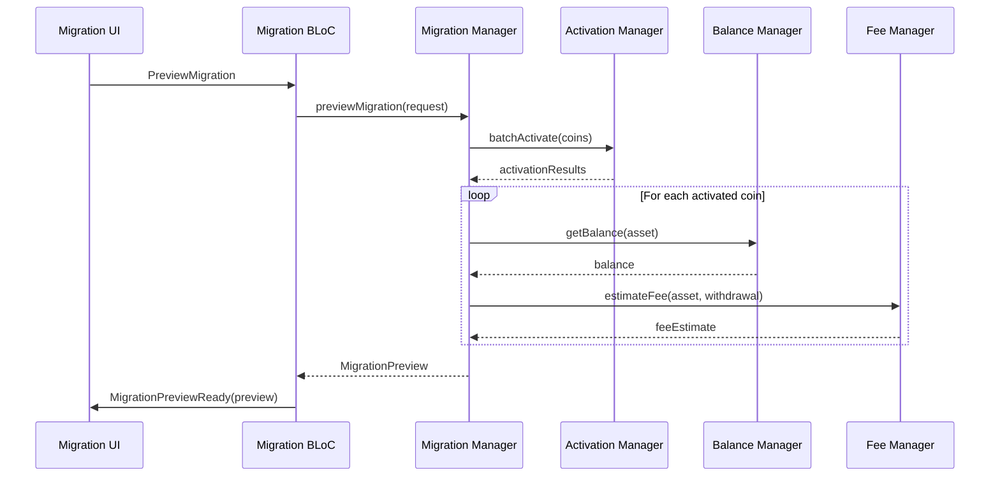
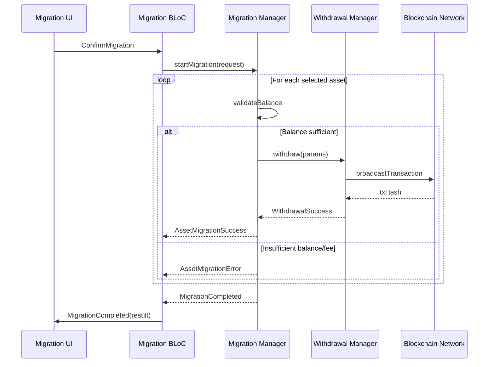
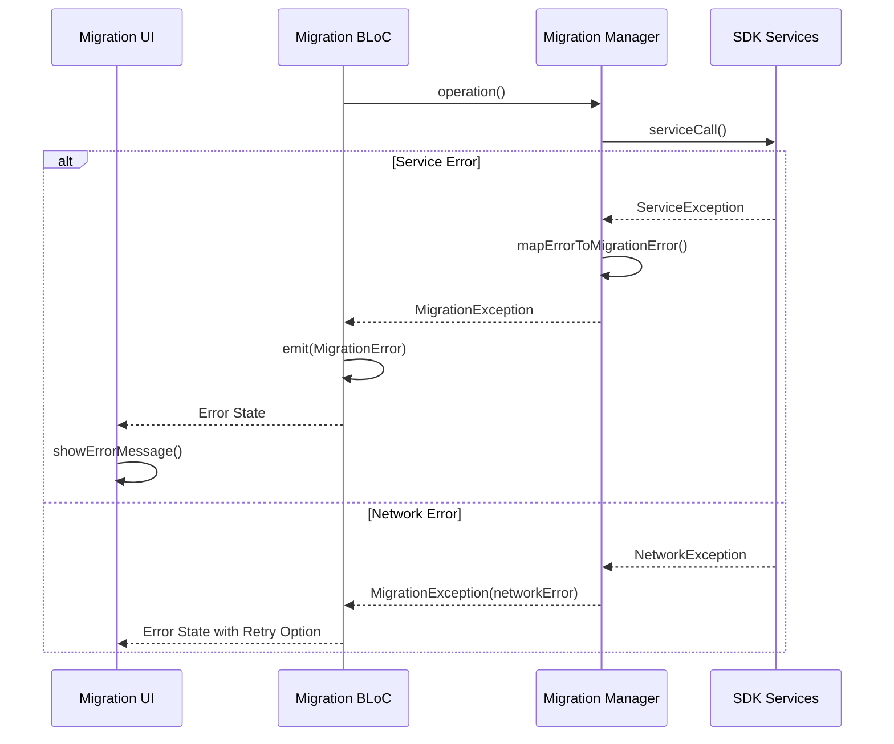

# One-Click Migration Feature - Implementation Plan & Architecture

## 1. Overview

This document outlines the implementation plan and architecture for the one-click migration feature that allows users to migrate cryptocurrency balances from one wallet to another (primarily from Iguana to HD wallets) within the Komodo DeFi SDK.

## 2. Architecture Overview

The migration feature follows the established clean architecture pattern used throughout the Komodo DeFi SDK:

```
┌─────────────────────────────────────────────────────────────┐
│                    Presentation Layer                        │
│  ┌─────────────────┐  ┌─────────────────┐  ┌──────────────┐  │
│  │ Migration BLoC  │  │ Migration UI    │  │ Migration    │  │
│  │                 │  │ Components      │  │ States       │  │
│  └─────────────────┘  └─────────────────┘  └──────────────┘  │
└─────────────────────────────────────────────────────────────┘
                                │
┌─────────────────────────────────────────────────────────────┐
│                     Domain Layer                            │
│  ┌─────────────────┐  ┌─────────────────┐  ┌──────────────┐  │
│  │ Migration       │  │ Migration       │  │ Migration    │  │
│  │ Manager         │  │ Models          │  │ Errors       │  │
│  └─────────────────┘  └─────────────────┘  └──────────────┘  │
└─────────────────────────────────────────────────────────────┘
                                │
┌─────────────────────────────────────────────────────────────┐
│                      Data Layer                             │
│  ┌─────────────────┐  ┌─────────────────┐  ┌──────────────┐  │
│  │ Activation      │  │ Withdrawal      │  │ Balance      │  │
│  │ Manager         │  │ Manager         │  │ Manager      │  │
│  └─────────────────┘  └─────────────────┘  └──────────────┘  │
└─────────────────────────────────────────────────────────────┘
```

## 3. Core Components

### 3.1 Domain Layer

#### MigrationManager
The central service responsible for orchestrating the migration process:

```dart
class MigrationManager {
  MigrationManager(
    this._client,
    this._assetProvider,
    this._activationManager,
    this._withdrawalManager,
    this._balanceManager,
    this._feeManager,
  );

  // Core migration methods
  Future<MigrationPreview> previewMigration(MigrationRequest request);
  Stream<MigrationProgress> startMigration(MigrationRequest request);
  Future<void> cancelMigration(String migrationId);
  Future<MigrationResult> retryFailedAssets(String migrationId, List<String> assetIds);
}
```

#### Data Models

**MigrationRequest**
```dart
class MigrationRequest {
  final WalletId sourceWalletId;
  final WalletId targetWalletId;
  final List<AssetId> selectedAssets;
  final bool activateCoinsOnly;
  final Map<AssetId, WithdrawalFeeLevel> feePreferences;
}
```

**MigrationPreview**
```dart
class MigrationPreview {
  final String previewId;
  final WalletId sourceWallet;
  final WalletId targetWallet;
  final List<AssetMigrationPreview> assets;
  final MigrationSummary summary;
  final DateTime createdAt;
}
```

**AssetMigrationPreview**
```dart
class AssetMigrationPreview {
  final AssetId assetId;
  final String sourceAddress;
  final String targetAddress;
  final Decimal balance;
  final Decimal estimatedFee;
  final Decimal netAmount;
  final MigrationAssetStatus status;
  final String? errorMessage;
}
```

#### Error Handling
```dart
enum MigrationError {
  activationFailed,
  insufficientBalance,
  insufficientFee,
  txCreationFailed,
  txBroadcastFailed,
  walletLocked,
  invalidWallet,
  networkError,
}

class MigrationException implements Exception {
  final MigrationError error;
  final String message;
  final dynamic originalError;
}
```

### 3.2 Presentation Layer (BLoC Pattern)

#### Migration BLoC Events
```dart
abstract class MigrationEvent {}

class InitializeMigration extends MigrationEvent {
  final WalletId sourceWallet;
  final WalletId targetWallet;
}

class ToggleAssetFilter extends MigrationEvent {
  final bool activatedOnly;
}

class SelectAsset extends MigrationEvent {
  final AssetId assetId;
  final bool selected;
}

class PreviewMigration extends MigrationEvent {}

class ConfirmMigration extends MigrationEvent {
  final String previewId;
}

class RetryFailedAssets extends MigrationEvent {
  final String migrationId;
  final List<AssetId> assetIds;
}

class CancelMigration extends MigrationEvent {
  final String migrationId;
}
```

#### Migration BLoC States
```dart
abstract class MigrationState {}

class MigrationInitial extends MigrationState {}

class MigrationLoading extends MigrationState {
  final String? message;
}

class MigrationWalletSelection extends MigrationState {
  final List<WalletInfo> availableWallets;
}

class MigrationAssetSelection extends MigrationState {
  final List<AssetInfo> availableAssets;
  final Set<AssetId> selectedAssets;
  final bool showActivatedOnly;
}

class MigrationPreviewReady extends MigrationState {
  final MigrationPreview preview;
}

class MigrationInProgress extends MigrationState {
  final String migrationId;
  final List<AssetMigrationProgress> assetProgress;
  final int completedCount;
  final int totalCount;
}

class MigrationCompleted extends MigrationState {
  final MigrationResult result;
}

class MigrationError extends MigrationState {
  final String message;
  final MigrationError? error;
}
```

## 4. Sequence Diagrams

### 4.1 Migration Preview Flow



### 4.2 Migration Execution Flow



### 4.3 Error Handling Flow



## 5. Integration Points

### 5.1 Existing SDK Services Integration

The MigrationManager integrates with existing SDK services:

- **ActivationManager**: For batch coin activation
- **BalanceManager**: For querying asset balances  
- **WithdrawalManager**: For executing fund transfers
- **FeeManager**: For fee estimation
- **AssetManager**: For asset information
- **PubkeyManager**: For address generation

### 5.2 Authentication & Security

- Uses existing `KomodoDefiLocalAuth` for wallet access
- All private key operations remain within existing secure boundaries
- No additional authentication requirements

## 6. Configuration & Batching

### 6.1 Batch Processing
```dart
class MigrationConfig {
  static const int defaultBatchSize = 10;
  static const Duration defaultTimeout = Duration(minutes: 5);
  static const int maxRetryAttempts = 3;
  
  final int activationBatchSize;
  final Duration operationTimeout;
  final int retryAttempts;
}
```

### 6.2 Remote Configuration
```dart
abstract class MigrationConfigProvider {
  Future<MigrationConfig> getConfig();
}

class RemoteMigrationConfig implements MigrationConfigProvider {
  // Implementation for remote config fetching
}
```

## 7. Logging & Analytics

### 7.1 Logging Strategy
```dart
class MigrationLogger {
  static const String _loggerName = 'MigrationManager';
  static final Logger _logger = Logger(_loggerName);
  
  static void logMigrationStart(String migrationId, int assetCount) {
    _logger.info('Migration started: $migrationId, assets: $assetCount');
  }
  
  static void logAssetResult(String migrationId, AssetId assetId, bool success) {
    _logger.info('Asset migration result: $migrationId, $assetId, success: $success');
  }
  
  static void logMigrationComplete(String migrationId, MigrationResult result) {
    _logger.info('Migration completed: $migrationId, success: ${result.successCount}/${result.totalCount}');
  }
}
```

### 7.2 Analytics Events
- Migration initiated
- Preview generated
- Migration started
- Asset migration success/failure
- Migration completed
- Retry attempts

**Note**: No sensitive data (addresses, amounts, txIds) in analytics

## 8. Testing Strategy

### 8.1 Unit Tests
- MigrationManager business logic
- BLoC state transitions
- Error handling scenarios
- Model serialization/deserialization

### 8.2 Integration Tests
- End-to-end migration flow
- Service integration points
- Error scenarios (network failures, insufficient funds)
- Batch processing edge cases

### 8.3 Widget Tests
- Migration UI components
- State-dependent UI updates
- User interaction flows
- Error message display

## 9. Performance Considerations

### 9.1 Memory Management
- Dispose of streams and subscriptions properly
- Use pagination for large asset lists
- Cache activation results temporarily

### 9.2 Network Optimization
- Batch API calls where possible
- Implement exponential backoff for retries
- Cancel ongoing operations when needed

## 10. Security Considerations

### 10.1 Fund Safety
- Preview before execution
- User confirmation required
- No automatic retries
- Transaction signing remains local

### 10.2 Error Transparency
- Clear error messages for users
- Detailed logging for debugging
- No sensitive data exposure

## 11. Implementation Phases

### Phase 1: Core Domain Layer (2 weeks)
- MigrationManager implementation
- Data models and error types
- Integration with existing services
- Unit tests

### Phase 2: BLoC & State Management (1 week)
- Migration BLoC implementation
- State management
- Event handling
- BLoC tests

### Phase 3: UI Components (2 weeks)
- Migration screens
- Progress indicators
- Error handling UI
- Widget tests

### Phase 4: Integration & Testing (1 week)
- End-to-end testing
- Performance optimization
- Bug fixes and polish
- Documentation updates

### Phase 5: Release Preparation (1 week)
- Final QA
- Documentation completion
- Release notes
- Deployment preparation

## 12. Future Enhancements

- Automatic fee bumping (RBF) for stuck transactions
- Background migration with notifications
- Multi-language error messages
- Migration templates for common scenarios
- Cross-chain migration support

## 13. Success Criteria

- Users can migrate all eligible assets in one operation
- Clear preview of migration costs and results
- Robust error handling with actionable messages
- No loss of funds during migration
- Performance acceptable for typical use cases (10-50 assets)
- Comprehensive test coverage (>90%)
- Zero critical security vulnerabilities